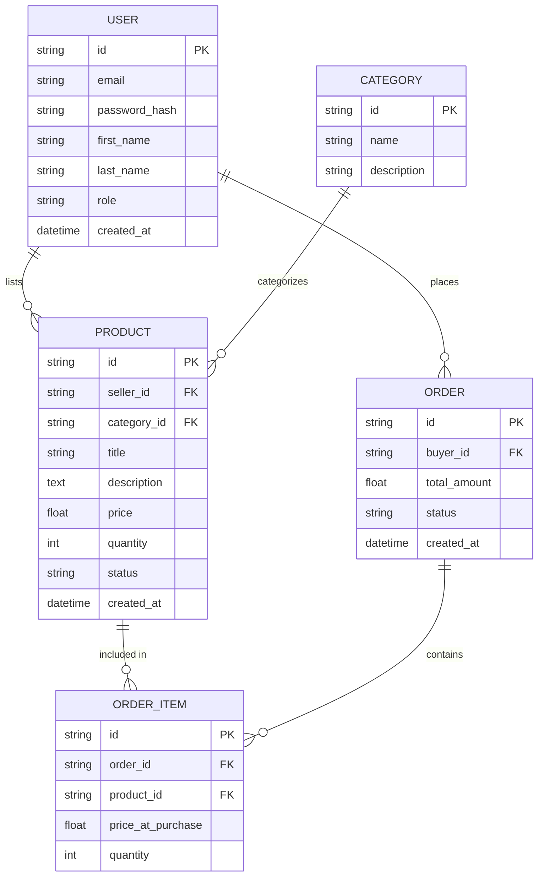

CHAPTER 5: SYSTEM DESIGN

This chapter presents the comprehensive system design of the CampusCrate application, outlining the architectural framework, database models, modular components, and proposed user interfaces. The design ensures scalability, maintainability, and a seamless user experience.

5.1 System Architecture

CampusCrate employs a modern Client-Server Architecture utilizing a decoupled frontend and backend approach to maintain separation of concerns and enable flexible feature development.

5.1.1 High-Level Architecture Diagram


5.1.2 Component Description
Client End (User Interface): A responsive Next.js application built with React, providing dynamic interactions for browsing, selling, and managing products. 
Application Logic (Backend): Server handling business logic, authentication parsing, marketplace inventory management, and query transactions.
Data Persistence (Database): A relational SQL database mapping users to products, orders, and interactions. Kysely adapter is configured for type-safe database queries.

5.2 Database Schema Design

The relational database model captures the essential entities of the marketplace: Users, Categories, Products, and Transactions (Orders).

5.2.1 Entity-Relationship Diagram (ERD)



5.3 Modular Breakdown

The system is organized into decoupled modules, each representing specific functional domains.

5.3.1 Frontend Modules
1. **Authentication Module:** Handles user registration, login, token management, and OAuth integrations utilizing `Better Auth`.
2. **Marketplace Module:** Dedicated to product listing, search, filtering, and detailed product views.
3. **User Dashboard Module:** Allows users to view their listings, manage profile settings, check order history, and handle account configurations.
4. **Checkout/Transaction Module:** Manages the cart state, payment processing, and order confirmation.

5.3.2 Backend Modules
1. API Routing Layer: Centralized REST or GraphQL endpoints processing incoming requests and routing them to the correct services.
2. Business Logic Layer: The core controllers managing the creation/deletion of resources, managing transaction states, and authorization checks.
3. Data Access Layer: Database queries and ORM mechanisms to maintain schema integrity and fetch/write data securely.

5.4 User Interface Mockups

The User Interface is designed to be intuitive, clean, and accessible, catering primarily to university students.

5.4.1 Landing Page Mockup

+-------------------------------------------------------------+
| [CampusCrate Logo]      Search...          [Login] [Sign Up]|
+-------------------------------------------------------------+
|                                                             |
|           BUY AND SELL EVERYTHING ON CAMPUS                 |
|      [ Browse Categories ]    [ Post an Ad Today ]          |
|                                                             |
+-------------------------------------------------------------+
| Featured Categories:                                        |
|  [ Textbooks ]  [ Electronics ]  [ Furniture ]  [ Services ]|
+-------------------------------------------------------------+
| Recently Added:                                             |
| +-------+  +-------+  +-------+  +-------+                  |
| |Img 1  |  |Img 2  |  |Img 3  |  |Img 4  |                  |
| |Item 1 |  |Item 2 |  |Item 3 |  |Item 4 |                  |
| |$15.00 |  |$45.00 |  |$10.00 |  |$120.0|                  |
| +-------+  +-------+  +-------+  +-------+                  |
+-------------------------------------------------------------+
| Footer: About Us, FAQ, Contact, Terms                       |
+-------------------------------------------------------------+


5.4.2 User Dashboard Mockup

+-------------------------------------------------------------+
| [CampusCrate Logo]      Search...                [User Menu]|
+-------------------------------------------------------------+
| +----------------+ +--------------------------------------+ |
| | Navigation     | | Active Listings (3)                    | |
| | - Profile      | | +-------+ Item A - $20     [Edit]      | |
| | - My Listings  | | | Image | Status: Active   [Delete]    | |
| | - Messages     | | +-------+                              | |
| | - Orders       | | +-------+ Item B - $50     [Edit]      | |
| | - Settings     | | | Image | Status: Pending  [Delete]    | |
| |                | | +-------+                              | |
| +----------------+ |                                      | |
|                    | [+ Add New Listing ]                   | |
|                    |                                      | |
|                    +--------------------------------------+ |
+-------------------------------------------------------------+
```

5.5 Conclusion of Design
The architectural decisions, schema layouts, and mockups illustrated in this chapter provide a concrete foundation for the implementation phase. These blueprints assure a maintainable, high-performance web platform tailored for the CampusCrate university ecosystem.
